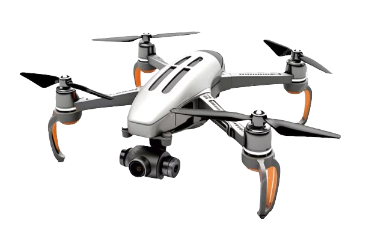
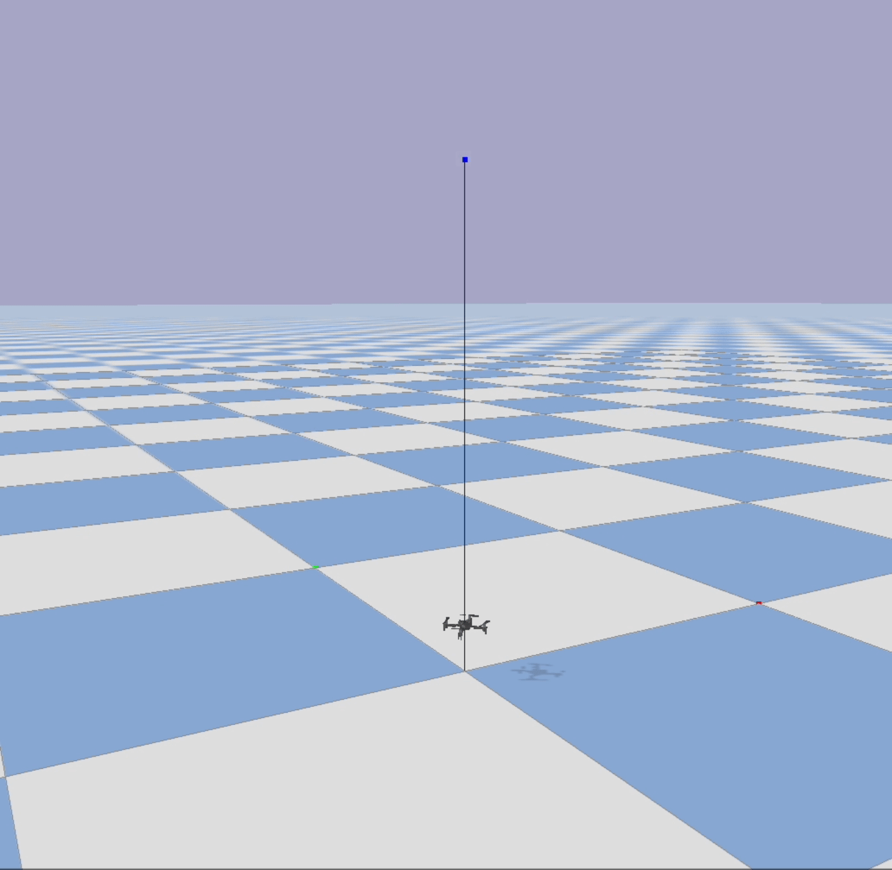
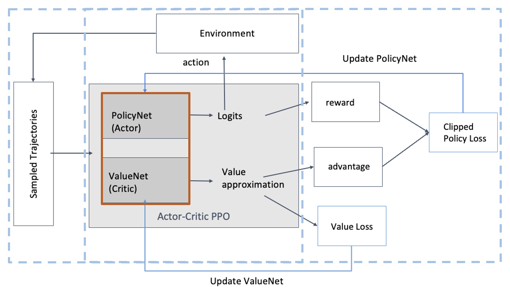
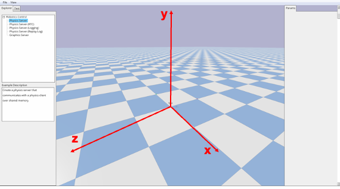

<!-- Improved compatibility of back to top link: See: https://github.com/othneildrew/Best-README-Template/pull/73 -->
<a name="readme-top"></a>
<!--
*** Thanks for checking out the Best-README-Template. If you have a suggestion
*** that would make this better, please fork the repo and create a pull request
*** or simply open an issue with the tag "enhancement".
*** Don't forget to give the project a star!
*** Thanks again! Now go create something AMAZING! :D
-->


<!-- PROJECT SHIELDS -->
<!--
*** I'm using markdown "reference style" links for readability.
*** Reference links are enclosed in brackets [ ] instead of parentheses ( ).
*** See the bottom of this document for the declaration of the reference variables
*** for contributors-url, forks-url, etc. This is an optional, concise syntax you may use.
*** https://www.markdownguide.org/basic-syntax/#reference-style-links
-->

<!---
<script src="https://polyfill.io/v3/polyfill.min.js?features=es6"></script>
<script id="MathJax-script" async src="https://cdn.jsdelivr.net/npm/mathjax@3/es5/tex-mml-chtml.js"></script>
-->


<div align="center">
  <a href="https://github.com/JaninaMattes/Autonomous-Explorer-Drone/issues">
    
  </a>
  <a href="https://github.com/JaninaMattes/Autonomous-Explorer-Drone/blob/master/LICENSE">
    
  </a>
  <a href="https://www.python.org/">
    
  </a>
  <a href="https://pytorch.org/">
    
  </a>
</div>


<!-- PROJECT LOGO -->
<br />
<div align="center">
  <a href="https://github.com/JaninaMattes/Autonomous-Explorer-Drone/blob/master/">
    
  </a>

  <h3 align="center">Autonomous Explorer Drone</h3>

  <p align="center">
    Exploring a learning-based method to autonomous flight.
    <br />
    <a href="https://github.com/JaninaMattes/Autonomous-Explorer-Drone/blob/master/Get_Started.md"><strong>Getting started »</strong></a>
    <br />
    <br />
    <!-- 
    <a href="https://github.com/othneildrew/Best-README-Template">View Demo</a>
    ·
    <a href="https://github.com/othneildrew/Best-README-Template/issues">Report Bug</a>
    ·
    <a href="https://github.com/othneildrew/Best-README-Template/issues">Request Feature</a>
    -->
  </p>
</div>


<!-- TABLE OF CONTENTS -->
<details>
  <summary>Table of Contents</summary>
  <ol>
    <li>
      <a href="#about-the-project">About The Project</a>
      <ul>
        <li><a href="#built-with">Built With</a></li>
      </ul>
    </li>
    <li>
      <a href="#getting-started">Getting Started</a>
      <ul>
        <li><a href="#prerequisites">Prerequisites</a></li>
        <li><a href="#installation">Installation</a></li>
      </ul>
    </li>
    <li><a href="#usage">Usage</a></li>
    <li><a href="#roadmap">Roadmap</a></li>
    <li><a href="#contributing">Contributing</a></li>
    <li><a href="#license">License</a></li>
    <li><a href="#contact">Contact</a></li>
    <li><a href="#acknowledgments">Acknowledgments</a></li>
  </ol>
</details>


<!-- ABOUT THE PROJECT -->
## About The Project

The design of a control system for an agile mobile robot in the continuous domain is a central question in robotics. This project specifically addresses the challenge of autonomous drone flight. Reinforcement learning (RL) is utilized as it can directly optimize a task-level objective and leverage domain randomization to handle model uncertainty, enabling the discovery of more robust control responses.

### Training Result

The following displays a training result where the model has learned to control the four rotors to overcome simulated gravity forces by the physics engine and go into steady flight.

<div align="center">
  <a href="https://github.com/JaninaMattes/Autonomous-Explorer-Drone/">
    
  </a>
  <br>
<small>Fig. 1: Illustration of the drone's steady flight during inference.</small>
</div>

#### PPO Actor-Critic Architecture

In this project the policy gradient method is used for training with a custom implementation of [Proximal Policy Optimization (PPO)](https://arxiv.org/pdf/1707.06347.pdf).

<div align="center">
  
  <br>
  <small>Fig. 2: Overview of the Actor-Critic Proximal Policy Optimisation Algorithm process</small>
</div>
</br>

The architecture consists of two separate neural networks: the actor network and the critic network. The actor network is responsible for selecting actions given the current state of the environment, while the critic network is responsible for evaluating the value of the current state.

The actor network takes the current state $s_t$ as input and outputs a probability distribution over the possible actions $a_t$. The network is trained using the actor loss function, which encourages the network to select actions that have a high advantage while also penalizing actions that deviate too much from the old policy. The loss function is defined as follows:

$$
L^{actor}(\theta) = \mathbb{E}_{t} \left[ \min\left(r_t(\theta) \hat{A}_t, \text{clip}\left(r_t(\theta), 1-\epsilon, 1+\epsilon\right) \hat{A}_t \right) \right]
$$

where $r_t(\theta) = \frac{\pi_{\theta}(a_t|s_t)}{\pi_{\theta_{old}}(a_t|s_t)}$ is the probability ratio of the new and old policies, $\hat{A}_t$ is the estimated advantage function, and $\epsilon$ is a hyperparameter that controls how much the new policy can deviate from the old policy.

The critic network takes the current state $s_t$ as input and outputs an estimate of the value of the state $V_{\theta}(s_t)$. The network is trained using the critic loss function, which encourages the network to accurately estimate the value of the current state, given the observed rewards and the estimated values of future states. The loss function is defined as follows:

$$
L^{critic}(\theta) = \mathbb{E}_{t} \left[ \left(V_{\theta}(s_t) - R_t\right)^2 \right]
$$

where $R_t$ is the target value for the current state, given by the sum of the observed rewards and the estimated values of future states.

#### Action and Observation Space

The observation space is defined through the quadrotor state, which includes the position, linear velocity, angular velocity, and orientation of the drone. The action space is defined by the desired thrust in the z direction and the desired torque in the x, y, and z directions.

#### Reward Function

The reward function is defined as follows:

$$
\text{Reward} =
\begin{cases}
-5, & \text{height} < 0.02 \\
-\frac{1}{10 \cdot y_{pos}}, & \text{height} \geq 0.02
\end{cases}
$$

where $y_{pos}$ is the current height of the drone. The reward function encourages the drone to maintain a certain height while also penalizing excessive movement in the y-axis.


<p align="right">(<a href="#readme-top">back to top</a>)</p>

### PyBullet Environment & Drone

#### Environment

The environment is a custom OpenAI Gym environment built using PyBullet for multi-agent reinforcement learning with quadrotors.

<div align="center">
  <a href="https://github.com/JaninaMattes/Autonomous-Explorer-Drone/">
    
  </a>
  </br>
  <small>Fig. 3: 3D simulation of the drone's orientation in the x, y, and z axes.</small>
</div>

#### PID Controller
- stabilize drone flight

<p align="right">(<a href="#readme-top">back to top</a>)</p>


### Built With

The project was developed using Python and the PyTorch machine learning framework. To simulate the quadrotor's environment, the PyBullet physics engine is leveraged. Further, to streamline the development process and avoid potential issues, the pre-built PyBullet drone implementation provided by the [gym-pybullet-drones library](https://github.com/utiasDSL/gym-pybullet-drones) is utilized.


Programming Languages-Frameworks-Tools<br /><br />
[](https://skillicons.dev)

<p align="right">(<a href="#readme-top">back to top</a>)</p>


<!-- GETTING STARTED -->
## Getting Started

This is an example of how you may give instructions on setting up your project locally.
To get a local copy up and running follow these simple example steps.

### Prerequisites

This is an example of how to list things you need to use the software and how to install them.
* npm
  ```sh
  npm install npm@latest -g
  ```

### Installation

_Below is an example of how you can instruct your audience on installing and setting up your app. This template doesn't rely on any external dependencies or services._

1. Get a free API Key at [https://example.com](https://example.com)
2. Clone the repo
   ```sh
   git clone https://github.com/your_username_/Project-Name.git
   ```
3. Install NPM packages
   ```sh
   npm install
   ```
4. Enter your API in `config.js`
   ```js
   const API_KEY = 'ENTER YOUR API';
   ```

<p align="right">(<a href="#readme-top">back to top</a>)</p>


<!-- ROADMAP -->
## Roadmap

- [x] Add Changelog
- [x] Add back to top links
- [ ] Fix sparse reward issue by adding prox rewards
- [ ] Adjustment of the reward function to achieve the approach of a target
- [ ] Implement in Unity with ML agents
- [ ] Adjust Readme file

<p align="right">(<a href="#readme-top">back to top</a>)</p>


<!-- LICENSE -->
## License

Distributed under the MIT License. See `LICENSE.txt` for more information.

<p align="right">(<a href="#readme-top">back to top</a>)</p>


<!-- CONTACT -->
## Contact

Project Link: [Autonomous-Explorer-Drone](https://github.com/JaninaMattes/Autonomous-Explorer-Drone/)

<p align="right">(<a href="#readme-top">back to top</a>)</p>


<!-- ACKNOWLEDGMENTS -->
## Acknowledgments

* [GitHub - ML Drone Collection](https://github.com/mbaske/ml-drone-collection)
* [Lab ML AI - PPO Explained](https://nn.labml.ai/rl/ppo/)
* [Huggingface - PPO Explained](https://huggingface.co/blog/deep-rl-ppo)
* [Pytorch Forum - Discussion](https://discuss.pytorch.org/t/understanding-log-prob-for-normal-distribution-in-pytorch/73809)
* [David Silver - Introduction to Reinforcement Learning](https://www.davidsilver.uk/teaching/)

<p align="right">(<a href="#readme-top">back to top</a>)</p>


<!-- MARKDOWN LINKS & IMAGES -->
<!-- https://www.markdownguide.org/basic-syntax/#reference-style-links -->
[contributors-shield]: https://img.shields.io/github/contributors/othneildrew/Best-README-Template.svg?style=for-the-badge
[contributors-url]: https://github.com/othneildrew/Best-README-Template/graphs/contributors
[forks-shield]: https://img.shields.io/github/forks/othneildrew/Best-README-Template.svg?style=for-the-badge
[forks-url]: https://github.com/othneildrew/Best-README-Template/network/members
[stars-shield]: https://img.shields.io/github/stars/othneildrew/Best-README-Template.svg?style=for-the-badge
[stars-url]: https://github.com/othneildrew/Best-README-Template/stargazers
[issues-shield]: https://img.shields.io/github/issues/othneildrew/Best-README-Template.svg?style=for-the-badge
[issues-url]: https://github.com/othneildrew/Best-README-Template/issues
[license-shield]: https://img.shields.io/github/license/othneildrew/Best-README-Template.svg?style=for-the-badge
[license-url]: https://github.com/othneildrew/Best-README-Template/blob/master/LICENSE.txt
[linkedin-shield]: https://img.shields.io/badge/-LinkedIn-black.svg?style=for-the-badge&logo=linkedin&colorB=555
[linkedin-url]: https://linkedin.com/in/othneildrew
[take-off-aviariy-gif]: images/gifs/drone-flight-takeoff.gif
[Next.js]: https://img.shields.io/badge/next.js-000000?style=for-the-badge&logo=nextdotjs&logoColor=white
[Next-url]: https://nextjs.org/
[React.js]: https://img.shields.io/badge/React-20232A?style=for-the-badge&logo=react&logoColor=61DAFB
[React-url]: https://reactjs.org/
[Vue.js]: https://img.shields.io/badge/Vue.js-35495E?style=for-the-badge&logo=vuedotjs&logoColor=4FC08D
[Vue-url]: https://vuejs.org/
[Angular.io]: https://img.shields.io/badge/Angular-DD0031?style=for-the-badge&logo=angular&logoColor=white
[Angular-url]: https://angular.io/
[Svelte.dev]: https://img.shields.io/badge/Svelte-4A4A55?style=for-the-badge&logo=svelte&logoColor=FF3E00
[Svelte-url]: https://svelte.dev/
[Laravel.com]: https://img.shields.io/badge/Laravel-FF2D20?style=for-the-badge&logo=laravel&logoColor=white
[Laravel-url]: https://laravel.com
[Bootstrap.com]: https://img.shields.io/badge/Bootstrap-563D7C?style=for-the-badge&logo=bootstrap&logoColor=white
[Bootstrap-url]: https://getbootstrap.com
[JQuery.com]: https://img.shields.io/badge/jQuery-0769AD?style=for-the-badge&logo=jquery&logoColor=white
[JQuery-url]: https://jquery.com 
